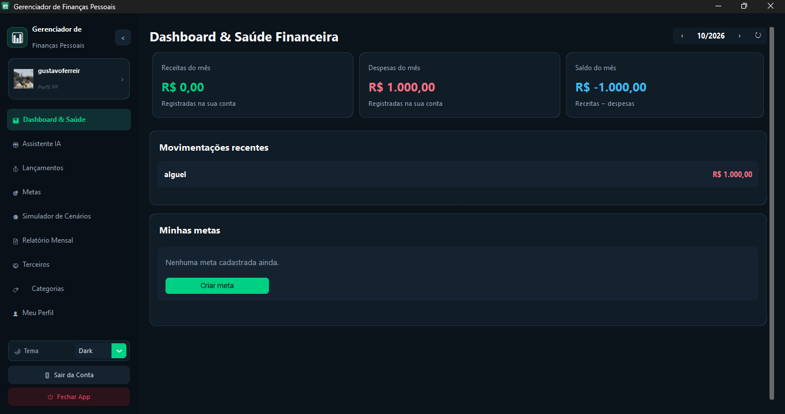
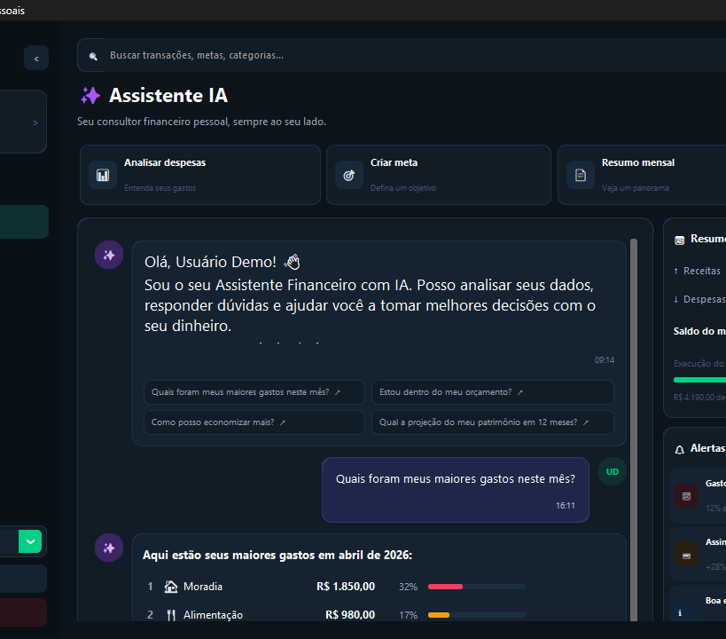
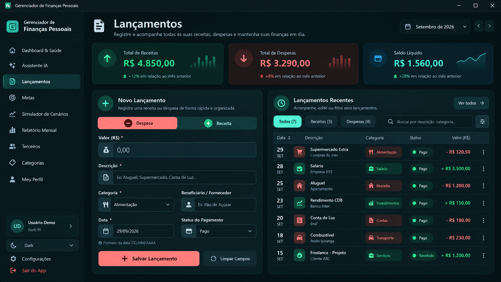
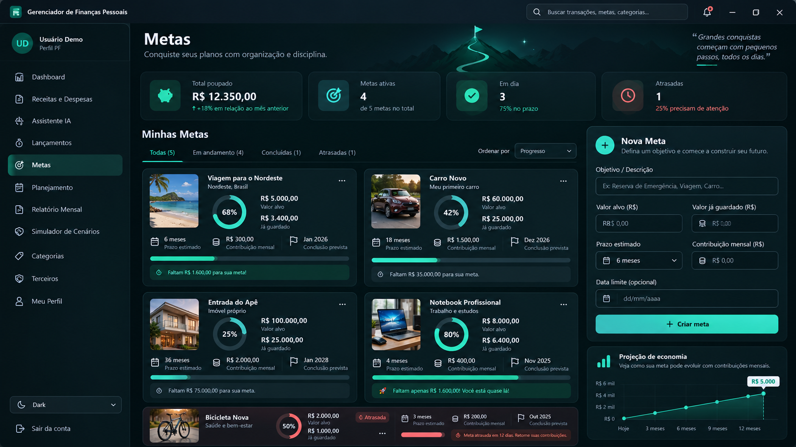
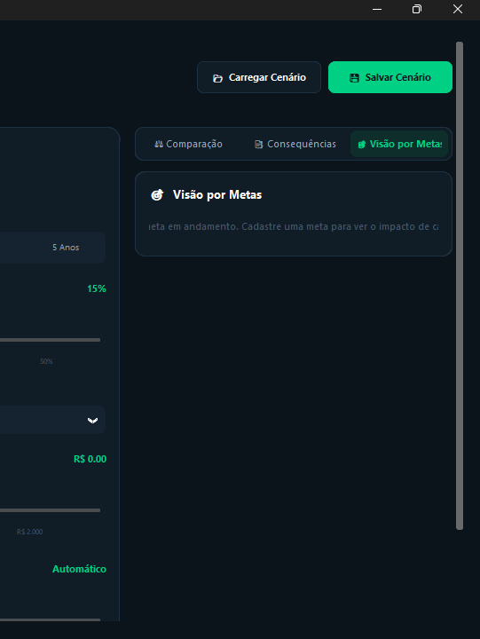
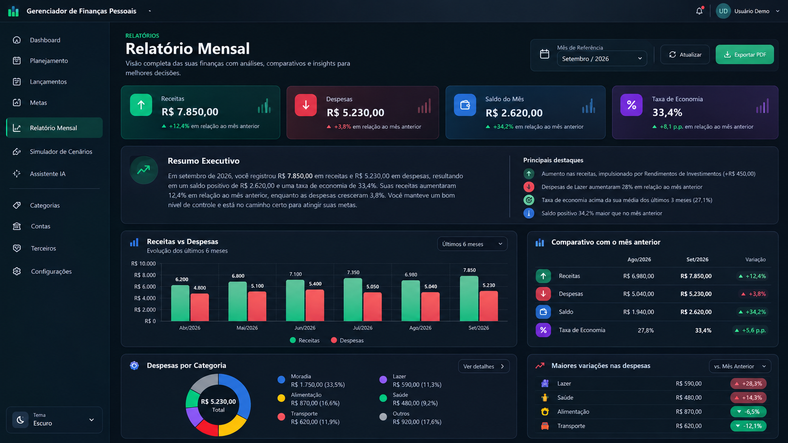
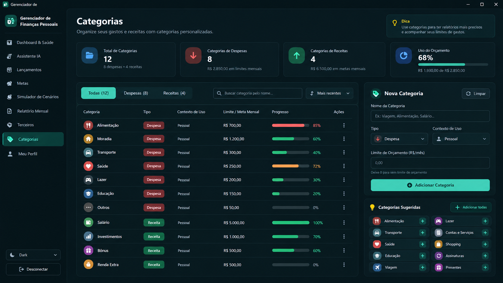
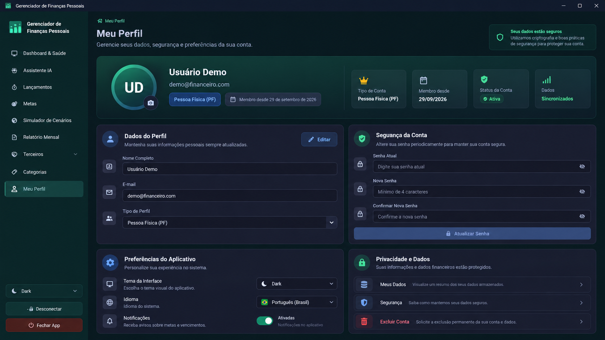
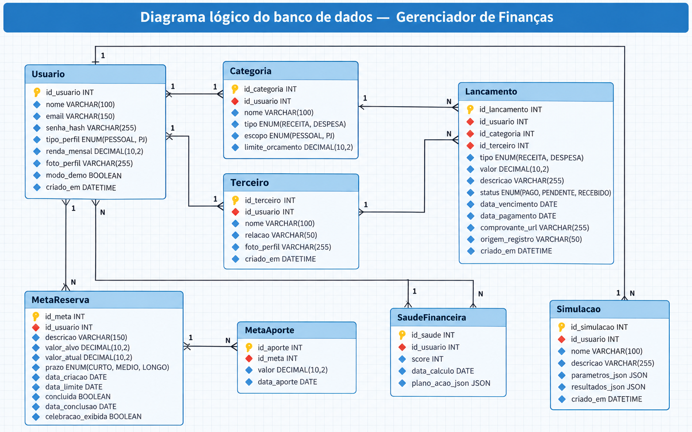

# 💰 Gerenciador de Finanças Pessoais

Aplicação desktop desenvolvida em **Python e CustomTkinter**, com banco de dados **MySQL**, para ajudar pessoas e pequenos negócios a organizar suas finanças. O sistema reúne receitas, despesas, metas, relatórios e simulações em uma interface única, com um **assistente financeiro com IA** como recurso opcional.

## 🎯 Problema e objetivo

**Problema:** muitas pessoas registram gastos de forma desorganizada e acabam sem saber quanto receberam, quanto gastaram ou quanto ainda podem utilizar no mês.

**Objetivo:** centralizar essas informações para facilitar o controle do orçamento, acompanhar objetivos financeiros e apoiar decisões de maneira visual e prática. O projeto surgiu a partir de ideias trabalhadas no **PISM**.

## ✨ Funcionalidades principais

| Módulo | O que faz |
| --- | --- |
| 📊 **Dashboard** | Reúne receitas, despesas, saldo, movimentações recentes e um resumo das metas. É a visão geral da conta. |
| ❤️ **Saúde Financeira** | Analisa a situação do mês por meio de indicadores, pontuação e orientações. Quando faltam dados, informa isso sem inventar valores. |
| 🤖 **Assistente IA** | Ajuda a entender gastos, analisar o orçamento e responder perguntas financeiras. A integração com **Google Gemini** é opcional. |
| 💰 **Lançamentos** | Permite cadastrar e consultar receitas e despesas, com valor, descrição, categoria, datas, status e filtros. |
| 🎯 **Metas Financeiras** | Organiza objetivos de economia. O usuário define um valor-alvo, registra aportes e acompanha o progresso até a conclusão. |
| 🔮 **Simulador de Cenários** | Projeta situações futuras, como redução de gastos, renda extra ou novos aportes. Permite comparar cenários e observar impactos nas metas. |
| 📄 **Relatório Mensal** | Apresenta um resumo das movimentações do período, gráficos e comparação entre entradas e saídas. |
| 🤝 **Terceiros** | Cadastra pessoas e estabelecimentos relacionados às movimentações, como clientes e fornecedores. |
| 🏷️ **Categorias** | Separa receitas e despesas por tipo, como alimentação, moradia e salário, com possibilidade de definir limites de gastos. |
| 👤 **Meu Perfil** | Permite atualizar dados da conta, renda, senha, foto e o tipo de perfil (**Pessoal** ou **PJ**). |

### Como funciona na prática?

1. O usuário **cria uma conta** e entra no aplicativo.
2. Cadastra **categorias** e registra suas **receitas e despesas**.
3. O **Dashboard** e os **Relatórios** mostram para onde o dinheiro está indo.
4. A **Saúde Financeira** analisa a situação do mês; as **Metas** acompanham objetivos de economia.
5. O **Simulador** e o **Assistente IA** ajudam a avaliar possibilidades e planejar próximos passos.

**Dados das contas:** os registros ficam salvos no MySQL e são separados por usuário. Uma conta nova começa sem movimentações. A opção **Gerar dados aleatórios** cria dados fictícios apenas quando solicitada.

## 🚀 Instalação e execução

**1. Instale os programas necessários**

- [Python 3.10 ou superior](https://www.python.org/downloads/) — no Windows, marque **Add Python to PATH**.
- [MySQL Server](https://dev.mysql.com/downloads/mysql/) — instale e mantenha o serviço iniciado.

**2. Abra a pasta do projeto no VS Code** e instale as dependências no terminal:

```bash
python -m pip install -r requirements.txt
```

**3. Configure o banco de dados:** copie `.env.example` para `.env` na raiz do projeto e edite as informações:

```env
MYSQL_HOST=localhost
MYSQL_PORT=3306
MYSQL_USER=root
MYSQL_PASSWORD=sua_senha
MYSQL_DATABASE=gerenciador_financeiro
AI_API_KEY=
```

> O campo `AI_API_KEY` só precisa ser preenchido para utilizar o Gemini. Com o MySQL conectado e as permissões necessárias, o aplicativo cria automaticamente a estrutura das tabelas definida em `migrations/ddl/`.

**4. Inicie o aplicativo:**

```bash
python main.py
```

Na primeira execução, escolha **Criar Conta** para começar com seus próprios registros ou **Gerar dados aleatórios** para experimentar uma conta de demonstração.

## 🖼️ Prints do sistema

| Dashboard | Assistente IA |
| :---: | :---: |
|  |  |
| **Lançamentos** | **Metas** |
|  |  |
| **Simulador — Visão por Metas** | **Relatório Mensal** |
|  |  |
| **Categorias** | **Meu Perfil** |
|  |  |

## 🗃️ Banco de dados e arquitetura

O projeto utiliza a organização **MVC + DAO**, que separa as telas, as regras do sistema e o acesso aos dados:

- `views/` — interfaces e componentes visuais.
- `controllers/` — comunicação entre as telas e as operações.
- `models/` e `dao/` — modelos, conexão e consultas no MySQL.
- `services/` — cálculos, simulações, segurança e integração de IA.
- `migrations/` — scripts SQL para criar a estrutura do banco.
- `tests/` — testes automatizados.

As principais tabelas são **usuario, categoria, lancamento, terceiro, meta_reserva, meta_aporte, saude_financeira e simulacao**. Cada conta possui seus próprios registros; os lançamentos se relacionam a categorias e, opcionalmente, a terceiros.

### Diagrama lógico

O diagrama abaixo mostra as principais tabelas e como seus registros se relacionam. As ligações representam os vínculos entre usuários, categorias, lançamentos, metas e os demais dados financeiros.



## 🛠️ Tecnologias utilizadas

**Python** (lógica), **CustomTkinter** (interface), **MySQL** (persistência), **python-dotenv** (configurações), **Google Gemini** (IA opcional) e **unittest** (testes).

## 🧪 Testes e problemas comuns

Para executar os testes automatizados:

```bash
python -m unittest discover -s tests
```

- **Biblioteca não encontrada:** execute novamente `python -m pip install -r requirements.txt`.
- **Falha de conexão:** verifique se o MySQL está iniciado e se as credenciais do `.env` estão corretas.
- **Assistente indisponível:** confira a conexão com a internet e a chave de API.

> **Observações:** não publique seu arquivo `.env`, pois ele pode conter credenciais. O sistema não importa extratos bancários automaticamente e não oferece sincronização própria em nuvem. A IA depende de internet e pode enviar o conteúdo das consultas ao serviço Gemini.
